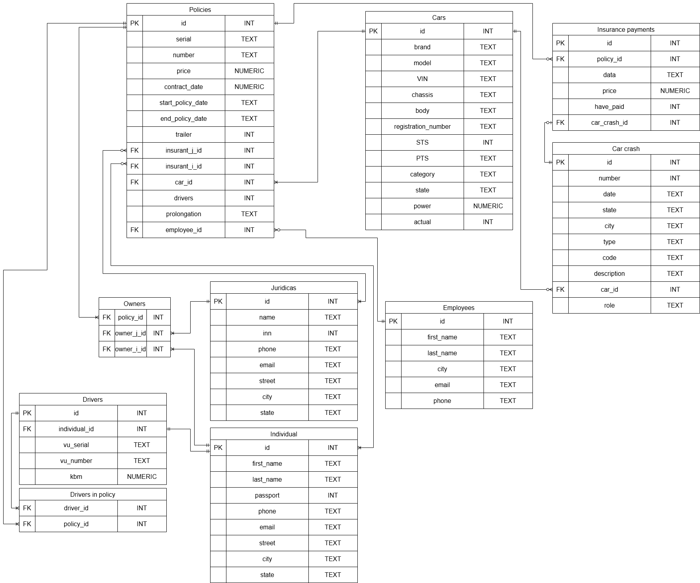

# Design Document

By Maltsev Maksim

Video overview: [<URL HERE>](https://youtu.be/ZeTF3TmDdas)

## Scope

The “Insurance Company” database is designed to store data about clients, insurance policies, car crashes and cars. It is designed to store information related to the activities of insurance company.

As such, included in the database's scope is:
* Policies, contains information about cars insurance policies
* Cars, contains information about cars
* Car crash, contains information about car crashes
* Insurance payments, contains information about insurance payments in case of an car crashes
* Employees, stores data about insurance agents
* Juridical, information about legal entities
* Individual, information about individuals
* Owners, stores information about car owners
* Drivers, stores information about drivers
* Driver in policy, contains information about drivers allowed to drive under an insurance policy.

Out of scope are elements like other types of insurance, detailed information on the activities of insurance companies.

## Functional Requirements

This database will support:

* Enter information about clients and cars
* Enter information about a car crash
* Enter information about insurance policies
* Receive data on policies, cars, car crash

The system will not support management and other operations in insurance company.

## Representation

Entities are captured in SQLite tables with the following schema.

### Entities

The database includes the following entities:

#### Policies

The `policies` table includes:

* `id` which specifies the unique ID for the policy as an `INTEGER`. This column thus has the `PRIMARY KEY` constraint applied.
* `serial` which specifies policy series as `TEXT`.
* `number` which specifies policy number as `TEXT`.
* `price` which specifies insurance premium as `NUMERIC`.
* `contract_date` which specifies policy issue date as `NUMERIC`.
* `start_policy_date` which specifies the policy start date as `TEXT`.
* `end_policy_date` which specifies the policy end date as `TEXT`.
* `trailer` which specifies using a car with a trailer as `INTEGER`. Can be or not can be trailer will be checked 0 or 1 `CHECK('trailer' BETWEEN 0 AND 1)`.
* `insurant_i_id` which is the ID of the insurant who is the insured in the policy as an `INTEGER`. This column thus has the `FOREIGN KEY` constraint applied, referencing the `id` column in the `individual` tables to ensure data integrity.
* `insurant_j_id` which is the ID of the insurant who is the insured in the policy as an `INTEGER`. This column thus has the `FOREIGN KEY` constraint applied, referencing the `id` column in the `juridical` tables to ensure data integrity.
* `car_id` which is the ID of the car the policy as an `INTEGER`. This column thus has the `FOREIGN KEY` constraint applied, referencing the `id` column in the `cars` table to ensure data integrity.
* `drivers` which specifies limited or unlimited count of drivers as `INTEGER`, where 0 - limited and 1 - unlimited `CHECK('drivers' BETWEEN 0 AND 1)`.
* `prolongation` which specifies previous policies as `TEXT`.
* `employee_id` which is the ID of the employee as an `INTEGER`. This column thus has the `FOREIGN KEY` constraint applied, referencing the `id` column in the `employees` table to ensure data integrity.

#### Cars

The `cars` table includes:

* `id` which specifies the unique ID for the policy as an `INTEGER`. This column thus has the `PRIMARY KEY` constraint applied.
* `brand` which specifies brand car as `TEXT`.
* `model` which specifies model car as `TEXT`.
* `vin` which specifies vin number car as `TEXT`.
* `chassis` which specifies vehicle chassis number as `TEXT`.
* `body` which specifies vehicle body number as `TEXT`.
* `registration_number` which specifies registration number car as `TEXT`.
* `sts` which specifies car registration certificate as `INTEGER`.
* `pts` which specifies passport of the technical device as `TEXT`.
* `category` which specifies car category as `TEXT`. A categories cars should include some values `CHECK("category" IN ('A', 'B', 'C', 'D', 'E'))`.
* `state` which specifies region of registration as `TEXT`.
* `power` which specifies power car as `NUMERIC`.
* `actual` which specifies actual data about car as `INTEGER`. It should be automatically 1, when registration of the automobile is actual. It is not relevant to become when the owner changes. Only actual or not relevant will be checked 0 or 1 `CHECK('actual' BETWEEN 0 AND 1)`.

#### Car crash

The `car_crash` table includes:

* `id` which specifies the unique ID for the policy as an `INTEGER`. This column thus has the `PRIMARY KEY` constraint applied.
* `number` which specifies car crash number as `INTEGER`.
* `date` which specifies the date of the car crash as `TEXT`.
* `state` which specifies the region of registration of a car crash as `TEXT`.
* `city` which specifies the city of registration of a car crash as `TEXT`.
* `type` which specifies car crash as `TEXT`. A type car crash should include some values `CHECK("type" IN ('rollovers', 'head-on collision', 'rear-end collision', 'side-impact accident'))`.
* `description` which specifies the description about a car crash as `TEXT`.
* `code` which specifies the code place and degree of damage as `TEXT`.
* `role` which specifies the role in a car crash as an `TEXT`. A role in a car crash should include some values `CHECK("role" IN ('victim', 'culprit'))`.
* `car_id` which is the ID of the car the policy as an `INTEGER`. This column thus has the `FOREIGN KEY` constraint applied, referencing the `id` column in the `cars` table to ensure data integrity.

#### Insurance payments

The `insurance_payments` table includes:

* `id` which specifies the unique ID for the policy as an `INTEGER`. This column thus has the `PRIMARY KEY` constraint applied.
* `car_crash_id` which is the ID of the car crash as an `INTEGER`. This column thus has the `FOREIGN KEY` constraint applied, referencing the `id` column in the `car_crash` table to ensure data integrity.
* `policy_id` which is the ID of the policy as an `INTEGER`. This column thus has the `FOREIGN KEY` constraint applied, referencing the `id` column in the `policies` table to ensure data integrity.
* `date` which specifies the date of the insurance payment as `TEXT`.
* `price` which specifies the amount of insurance payment as `NUMERIC`.
* `have_paid` which shows insurance payment status as `INTEGER`, where 0 - paid and 1 - not paid `CHECK('have_paid' BETWEEN 0 AND 1)`.

#### Employees

The `employees` table includes:

* `id` which specifies the unique ID for the policy as an `INTEGER`. This column thus has the `PRIMARY KEY` constraint applied.
* `first_name` which specifies the first name of the employee as `TEXT`.
* `last_name` which specifies the last name of the employee as `TEXT`.
* `city` which specifies the city of work as `TEXT`.
* `phone` which specifies the phone number of the employee as `TEXT`. Must contain only numbers `CHECK(`phone` GLOB ‘*[0-9]*’)`.
* `email` which specifies email employee as `TEXT`. @ sign control  `CHECK(`email` LIKE ‘%@%’)`.

#### Juridicas

The `juridicas` table includes:

* `id` which specifies the unique ID for the policy as an `INTEGER`. This column thus has the `PRIMARY KEY` constraint applied.
* `name` which specifies the company name as `TEXT`.
* `inn` which specifies an individual legal entity number as `INTEGER`.
* `phone` which specifies the contact phone number as `TEXT`. Must contain only numbers `CHECK("phone" GLOB '*[0-9]*')`.
* `email` which specifies contact email as `TEXT`. @ sign control  `CHECK("email" LIKE '%@%')`.
* `street` which specifies an street juridicas as `TEXT`.
* `city` which specifies an city juridicas as `TEXT`.
* `state` which specifies an state juridicas as `TEXT`.

#### Individuals

The `individuals` table includes:

* `id` which specifies the unique ID for the policy as an `INTEGER`. This column thus has the `PRIMARY KEY` constraint applied.
* `first_name` which specifies the first name of the individual as `TEXT`.
* `last_name` which specifies the last name of the individual as `TEXT`.
* `passport` which specifies the passport individual as `INTEGER`.
* `phone` which specifies the contact phone number as `TEXT`. Must contain only numbers `CHECK("phone" GLOB '*[0-9]*')`.
* `email` which specifies contact email as `TEXT`. @ sign control  `CHECK("email" LIKE '%@%')`.
* `street` which specifies an street individuals as `TEXT`.
* `city` which specifies an city individuals as `TEXT`.
* `state` which specifies an state individuals as `TEXT`.

#### Owners

The `owners` table includes:

* `policy_id` which is the ID of the policy as an `INTEGER`. This column thus has the `FOREIGN KEY` constraint applied, referencing the `id` column in the `policies` table to ensure data integrity.
* `owner_i_id` which is the ID of the employee as an `INTEGER`. This column thus has the `FOREIGN KEY` constraint applied, referencing the `id` column in the `individuals` table to ensure data integrity.
* `owner_j_id` which is the ID of the employee as an `INTEGER`. This column thus has the `FOREIGN KEY` constraint applied, referencing the `id` column in the `juridicas` table to ensure data integrity.

#### Drivers

The `drivers` table includes:

* `id` which specifies the unique ID for the policy as an `INTEGER`. This column thus has the `PRIMARY KEY` constraint applied.
* `individual_id` which is the ID of the policy as an `INTEGER`. This column thus has the `FOREIGN KEY` constraint applied, referencing the `id` column in the `individuals` table to ensure data integrity.
* `vu_serial` which specifies the driver's license series as `TEXT`.
* `vu_number` which specifies the driver's license number as `TEXT`.
* `kbm` which specifies bonus malus coefficient as `NUMERIC`.

#### Drivers in policy

The `drivers_policy` table includes:

* `policy_id` which is the ID of the policy as an `INTEGER`. This column thus has the `FOREIGN KEY` constraint applied, referencing the `id` column in the `policies` table to ensure data integrity.
* `driver_id` which is the ID of the employee as an `INTEGER`. This column thus has the `FOREIGN KEY` constraint applied, referencing the `id` column in the `drivers` table to ensure data integrity.

### Relationships

The entity relationship diagram below describes the relationships between entities in my database.

Description:

* One policy can only include one car, but several policies can be issued for one car (one-to-many relationship)
* One car may have no car crash or may have many (one-to-many relationship)
* One policy may have no or may have many insurance payments (one-to-many relationship)
* One employee may not have or may have many insurance policies (one-to-many relationship)
* A legal entity can be the policyholder of several cars or none of them (one-to-many relationship)
* An individual may be the policyholder of several cars or none of them (one-to-many relationship)
* One car can have several owners, and one legal entity or individual can be the owner of many cars (many-to-many relationship)
* One individual can be a driver (one-to-one relationship)
* One driver can drive many cars, and one car can be driven by mane drivers (many-to-many relationship)

## Optimizations

Indexing:
* `brand_model_car` to speed up cars search `barnd`, `model`
* `serial_number_policies` to speed up policies search `serial`, `number`
* `number_juridicas` to speed up juridicas search `inn`
* `car_crash_number` to speed up car crash search `number`
* `individuals_name` to speed up individuals search `first_name`, `last_name`
* `kbm_info` to get faster results for kbm drivers searches `vu_serial`, `vu_number`

Views:
* `average_cost_car_insurance` shows informations about average insurance premium by car brand
* `contacts_juridicas` shows informations about contacts a legal entity client
* `unpaid_compensation` shows informations unpaid insurance compensation to a legal entity client
* `total_sum_employee` shows informations about employees who issued policies

Triggers:
* `check_policy` It check existence of policy with given id
* `check_owner` It check existence of policy with given id
* `insert_new_policy` It when creating a new policy, it is added to the drivers table

## Limitations

This database does not show all the details of how an insurance company works.
* No renewal of insurance premium in case of contract renewal
* The driver's KBM value is not recalculated
* There is no array of necessary attributes that can be taken into account in the work of an insurance company
